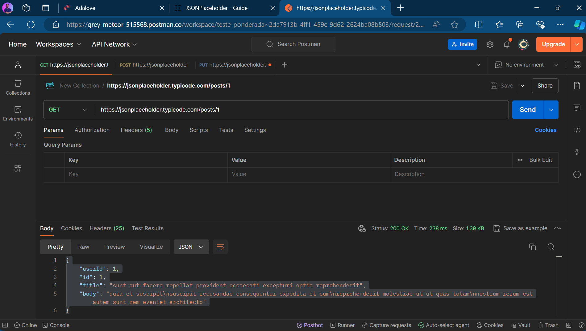
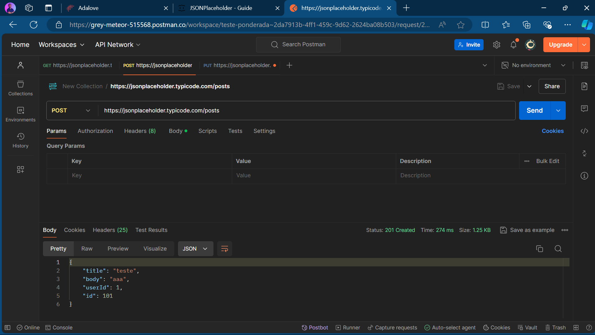
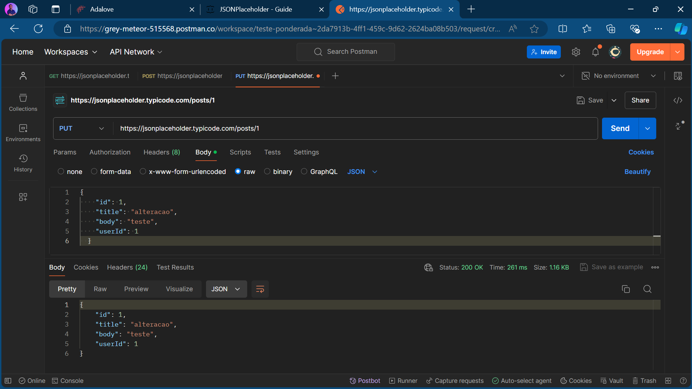
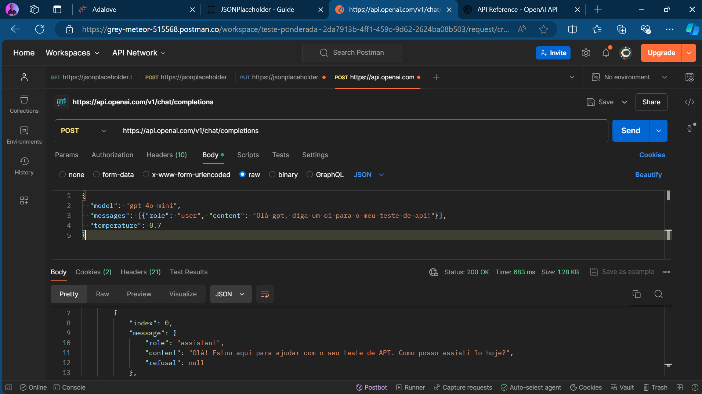

# Relatório: Uso de API JSONPlaceholder e OpenAI com Postman

## 1. Introdução

Este relatório tem como objetivo explorar o uso de APIs públicas, utilizando a ferramenta Postman para realizar requisições de diferentes tipos (GET, POST, PUT). As APIs escolhidas foram a JSONPlaceholder, uma API de teste gratuita que simula operações RESTful, e a API da OpenAI, usada para gerar respostas de modelos de linguagem. Através desta análise, será possível entender o funcionamento básico de requisições HTTP e interações com APIs, criando e manipulando dados.

## 2. Metodologia

A metodologia aplicada neste estudo envolveu a realização de três tipos de requisições às APIs JSONPlaceholder e OpenAI, conforme documentado em suas respectivas documentações. As requisições foram realizadas utilizando a ferramenta Postman, que permite testar endpoints de API de maneira simples e eficiente. As requisições selecionadas para análise foram:

- **GET /posts/1**: Obtenção de um dado específico na API JSONPlaceholder.
- **POST /posts**: Criação de um novo dado na API JSONPlaceholder.
- **PUT /posts/1**: Atualização de um dado existente.
- **POST /v1/chat/completions**: Envio de uma mensagem para o modelo GPT-4o-mini na API da OpenAI e obtenção de uma resposta.

As requisições foram realizadas conforme as instruções disponibilizadas nas documentações das APIs (TYPICODE, 2024; OPENAI, 2024). Cada requisição foi configurada com os parâmetros e valores necessários, e os resultados foram analisados em comparação com os resultados esperados.

## 3. Resultados

### 3.1 Requisição GET /posts/1

**Objetivo**: Obter as informações do post com ID 1 na API JSONPlaceholder.

**Parâmetros e valores utilizados**:  
- **Método**: GET  
- **URL**: `https://jsonplaceholder.typicode.com/posts/1`

**Resultado esperado**: Retorno do objeto JSON representando o post com ID 1, contendo os campos `id`, `title`, `body`, e `userId`.

**Resultado obtido**:  
```json
{
    "userId": 1,
    "id": 1,
    "title": "sunt aut facere repellat provident occaecati excepturi optio reprehenderit",
    "body": "quia et suscipit\nsuscipit recusandae consequuntur expedita et cum\nreprehenderit molestiae ut ut quas totam\nnostrum rerum est autem sunt rem eveniet architecto"
}
```
O resultado obtido foi conforme o esperado, com as informações completas do post sendo retornadas.

Imagem da requisição GET /posts/1 no Postman:


### 3.2 Requisição POST /posts

**Objetivo**: Criar um novo post na API JSONPlaceholder.

**Parâmetros e valores utilizados**:  
- **Método**: POST  
- **URL**: `https://jsonplaceholder.typicode.com/posts`  
- **Corpo (body)**:
  ```json
  {
    "title": "teste",
    "body": "aaa",
    "userId": 1
  }
  ```
- **Cabeçalhos**:
  - `Content-type: application/json; charset=UTF-8`

**Resultado esperado**: Criação de um novo post, com retorno do objeto JSON criado, incluindo um novo `id`.

**Resultado obtido**:  
```json
{
  "id": 101,
  "title": "teste",
  "body": "aaa",
  "userId": 1
}
```
O post foi criado com sucesso (na verdade é um *mock* que foi criado, como diz na documentação), e um novo ID foi atribuído ao dado, com o status de retorno 201 correto.

Imagem da requisição POST /posts no Postman:


### 3.3 Requisição PUT /posts/1

**Objetivo**: Atualizar o post existente com ID 1.

**Parâmetros e valores utilizados**:  
- **Método**: PUT  
- **URL**: `https://jsonplaceholder.typicode.com/posts/1`  
- **Corpo (body)**:
  ```json
  {
    "id": 1,
    "title": "alteracao",
    "body": "teste",
    "userId": 1
  }
  ```
- **Cabeçalhos**:
  - `Content-type: application/json; charset=UTF-8`

**Resultado esperado**: Atualização do post com ID 1, retornando o objeto JSON atualizado.

**Resultado obtido**:  
```json
{
  "id": 1,
  "title": "alteracao",
  "body": "teste",
  "userId": 1
}
```
A atualização foi realizada com sucesso, e o objeto JSON retornado reflete as mudanças aplicadas com o status 200 OK.

Imagem da requisição PUT /posts/1 no Postman:


### 3.4 Requisição POST /v1/chat/completions

**Objetivo**: Enviar uma mensagem para o modelo GPT-4o-mini da OpenAI e obter uma resposta.

**Parâmetros e valores utilizados**:  
- **Método**: POST  
- **URL**: `https://api.openai.com/v1/chat/completions`  
- **Corpo (body)**:
  ```json
  {
    "model": "gpt-4o-mini",
    "messages": [{"role": "user", "content": "Olá gpt, diga um oi para o meu teste de api!"}],
    "temperature": 0.7
  }
  ```
- **Cabeçalhos**:
  - `Content-Type: application/json`
  - `Authorization: MINHA CHAVE 😦`

**Resultado esperado**: Retorno de uma resposta gerada pelo modelo GPT-4o-mini.

**Resultado obtido**:  
```json
{
    "id": "chatcmpl-9uTxR8E4l8tBQyLVCSr1NrSMWIsaF",
    "object": "chat.completion",
    "created": 1723248553,
    "model": "gpt-4o-mini-2024-07-18",
    "choices": [
        {
            "index": 0,
            "message": {
                "role": "assistant",
                "content": "Olá! Estou aqui para ajudar com o seu teste de API. Como posso assisti-lo hoje?",
                "refusal": null
            },
            "logprobs": null,
            "finish_reason": "stop"
        }
    ],
    "usage": {
        "prompt_tokens": 21,
        "completion_tokens": 20,
        "total_tokens": 41
    },
    "system_fingerprint": "fp_507c9469a1"
}
```
A requisição foi bem-sucedida, e a resposta gerada pelo modelo GPT-4o-mini foi retornada com o conteúdo esperado.

Imagem da requisição POST /v1/chat/completions no Postman:


## 4. Conclusão

O objetivo deste relatório foi alcançado, demonstrando a capacidade de realizar operações básicas com APIs RESTful, utilizando a ferramenta Postman. As requisições GET, POST e PUT na API JSONPlaceholder foram executadas com sucesso, e os resultados obtidos corresponderam às expectativas descritas. Além disso, foi realizada uma requisição POST à API da OpenAI para gerar uma resposta do modelo GPT-4o-mini, que também obteve sucesso. Ambas as APIs se mostraram adequadas para fins de teste e desenvolvimento.

## Referências

TYPICODE. JSONPlaceholder Documentation. Disponível em: <https://jsonplaceholder.typicode.com/guide/>. Acesso em: 09 ago. 2024.

OPENAI. OpenAI API Documentation. Disponível em: <https://platform.openai.com/docs/api-reference>. Acesso em: 09 ago. 2024.